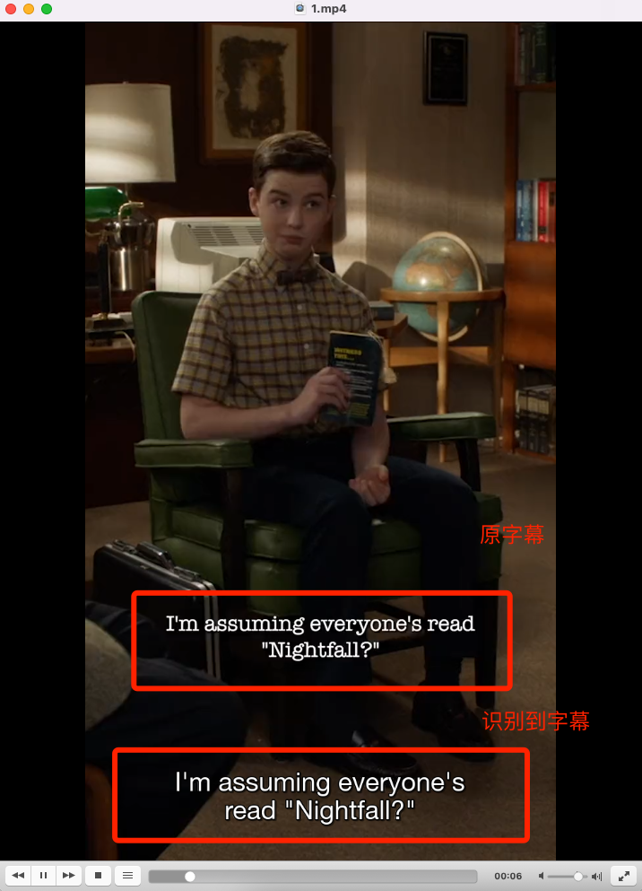

# cutoutSub

# how to run
```shell
pip3 install virtualenv && virtualenv -p python3.8 venv
source venv/bin/activate
pip install -r requirements.txt
python main.py
```

# 效果


# 存在的问题
算法好大佬可以give me hand，谷歌云每人每月给1000分钟免费时长，可以自己玩一下。16个小时够用了。

1. 消失过早
2. 镜头切换时不准确
3. 图像上有其他字符容易干扰
4. 原理就是Video AI将视频中所有文字都识别出来了，如何从中挑选出【字幕】

# 输出例子
```
Text: and broke up with you?
start_time: 53.2532, end_time: 54.8548
Confidence: 1.0
Time offset for the first frame: 53.2532
Rotated Bounding Box Vertices:
        Vertex.x: 0.24027778208255768, Vertex.y: 0.73828125
        Vertex.x: 0.7597090601921082, Vertex.y: 0.7403627038002014
        Vertex.x: 0.7594221234321594, Vertex.y: 0.7630183696746826
        Vertex.x: 0.23999086022377014, Vertex.y: 0.7609369158744812

Text: - No.
start_time: 54.9549, end_time: 55.5555
Confidence: 0.9407897591590881
Time offset for the first frame: 54.9549
Rotated Bounding Box Vertices:
        Vertex.x: 0.45277777314186096, Vertex.y: 0.7398437261581421
        Vertex.x: 0.5458333492279053, Vertex.y: 0.7398437261581421
        Vertex.x: 0.5458333492279053, Vertex.y: 0.7578125
        Vertex.x: 0.45277777314186096, Vertex.y: 0.7578125
1
00:00:00,300 --> 00:00:01,801
- I would like to call the first meeting

2
00:00:01,901 --> 00:00:04,304
of the Isaac Asimov book club to order.

3
00:00:04,404 --> 00:00:06,406
I'm assuming everyone's read "Nightfall?"

4
00:00:09,109 --> 00:00:10,410
- I read it.

5
00:00:10,510 --> 00:00:13,413
I may have dozed off a few times, but I read it.

6
00:00:13,513 --> 00:00:14,914
- I read it as well.

7
00:00:15,015 --> 00:00:17,017
I found it quite compelling.

8
00:00:17,117 --> 00:00:19,819
A planet that only experiences nightfall

9
00:00:19,919 --> 00:00:23,223
once every 2000 years.

10
00:00:23,323 --> 00:00:24,324
- And once it does, it drives everyone mad.

11
00:00:25,525 --> 00:00:26,226
Brilliant.

12
00:00:26,326 --> 00:00:27,927
- I found the tension between the scientists

13
00:00:28,028 --> 00:00:29,729
and the religious cultists reminiscent

14
00:00:29,829 --> 00:00:31,831
of some dinnertime conversations at my house.

15
00:00:31,931 --> 00:00:33,633
(laughing)

16
00:00:33,733 --> 00:00:35,235
What did you think, Connie?

17
00:00:35,335 --> 00:00:36,236
- What did you think, Connie?

18
00:00:36,336 --> 00:00:37,137
- Eh.

19
00:00:37,237 --> 00:00:38,238
You didn't like it?

20
00:00:38,338 --> 00:00:39,639
- I don't need a story set on some outer space planet

21
00:00:41,441 --> 00:00:43,943
to tell me that people freak out about change.

22
00:00:44,644 --> 00:00:45,045
-Interesting.

23
00:00:45,145 --> 00:00:47,147
People lost it when women started wearing pants

24
00:00:47,247 --> 00:00:48,448
and getting jobs.

25
00:00:48,548 --> 00:00:51,151
Everybody just overreacts to everything.

26
00:00:51,251 --> 00:00:53,153
- Is this because Coach Ballard got upset

27
00:00:53,253 --> 00:00:54,854
and broke up with you?

28
00:00:54,954 --> 00:00:55,555
- No.

```

案例：两次一样
```log
Text: -Interesting.
start_time: 44.6446, end_time: 45.045
Confidence: 0.9774123430252075
Time offset for the first frame: 44.6446
Rotated Bounding Box Vertices:
	Vertex.x: 0.3583333194255829, Vertex.y: 0.735156238079071
	Vertex.x: 0.6402698755264282, Vertex.y: 0.7363437414169312
	Vertex.x: 0.6398746967315674, Vertex.y: 0.7660304307937622
	Vertex.x: 0.35793814063072205, Vertex.y: 0.7648429274559021

Text: - Interesting.
时间太短<0.2s
非字幕
```

案例2:切镜头导致字幕消失快（某一行出现两次，冲掉了上一次）
```
Text: - And once it does, it
start_time: 23.3233, end_time: 24.3243
Confidence: 1.0
Time offset for the first frame: 23.3233
Rotated Bounding Box Vertices:
	Vertex.x: 0.27916666865348816, Vertex.y: 0.706250011920929
	Vertex.x: 0.7222092151641846, Vertex.y: 0.7081577181816101
	Vertex.x: 0.7219115495681763, Vertex.y: 0.7300320863723755
	Vertex.x: 0.27886897325515747, Vertex.y: 0.7281243801116943

Text: drives everyone mad.
start_time: 23.3233, end_time: 25.4254
Confidence: 1.0
Time offset for the first frame: 23.3233
Rotated Bounding Box Vertices:
	Vertex.x: 0.26249998807907104, Vertex.y: 0.737500011920929
	Vertex.x: 0.736081600189209, Vertex.y: 0.740472674369812
	Vertex.x: 0.7356011867523193, Vertex.y: 0.7646898627281189
	Vertex.x: 0.2620195746421814, Vertex.y: 0.7617172598838806

Text: And once it does, it
start_time: 24.4244, end_time: 24.6246
Confidence: 0.9871087074279785
Time offset for the first frame: 24.4244
Rotated Bounding Box Vertices:
	Vertex.x: 0.27916666865348816, Vertex.y: 0.706250011920929
	Vertex.x: 0.7222052216529846, Vertex.y: 0.7084335088729858
	Vertex.x: 0.7218523025512695, Vertex.y: 0.7310888767242432
	Vertex.x: 0.27881377935409546, Vertex.y: 0.7289053797721863
时间太短<0.2s
非字幕
```

案例3：时间一样，这个判断正确了
```
Text: ISAACASIM
start_time: 33.8338, end_time: 33.8338
Confidence: 0.8715739846229553
Time offset for the first frame: 33.8338
Rotated Bounding Box Vertices:
	Vertex.x: 0.6986111402511597, Vertex.y: 0.8671875
	Vertex.x: 0.81060391664505, Vertex.y: 0.9706051349639893
	Vertex.x: 0.7252009510993958, Vertex.y: 0.9998677372932434
	Vertex.x: 0.6132081747055054, Vertex.y: 0.8964501619338989
时间太短<0.2s
非字幕
```

案例4：同时出现的字幕，时间却不一样
```
Text: - I don't need a story set
start_time: 38.3383, end_time: 39.6396
Confidence: 1.0
Time offset for the first frame: 38.3383
Rotated Bounding Box Vertices:
	Vertex.x: 0.23749999701976776, Vertex.y: 0.7054687738418579
	Vertex.x: 0.7596940398216248, Vertex.y: 0.70852130651474
	Vertex.x: 0.7592321634292603, Vertex.y: 0.733519971370697
	Vertex.x: 0.23703815042972565, Vertex.y: 0.7304673790931702

Text: on some outer space planet
start_time: 38.3383, end_time: 41.3413
Confidence: 1.0
Time offset for the first frame: 38.3383
Rotated Bounding Box Vertices:
	Vertex.x: 0.2013888955116272, Vertex.y: 0.739062488079071
	Vertex.x: 0.8027777671813965, Vertex.y: 0.739062488079071
	Vertex.x: 0.8027777671813965, Vertex.y: 0.7632812261581421
	Vertex.x: 0.2013888955116272, Vertex.y: 0.7632812261581421
```

解决方案：合成一行之后，以大的为准
```python
# 结束时间取最大
new_end_time_timedelta = datetime.timedelta(seconds=end_time.seconds, microseconds=end_time.microseconds)
if sub_pre.endtime < new_end_time_timedelta:
    sub_pre.endtime = new_end_time_timedelta,
```
其实时间段重叠应该也相应处理。